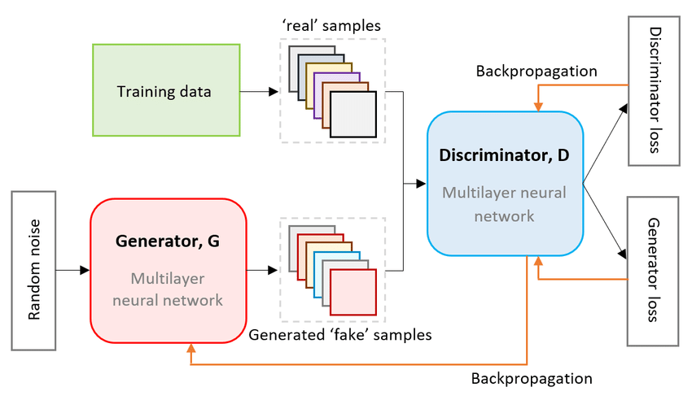

# **Generative Adversarial Networks (GANs)**:

---

### **1. Introduction to GANs**

**Generative Adversarial Networks (GANs)** are a class of deep learning models that generate new data instances that resemble the real data they were trained on. GANs consist of two neural networks: the **Generator** and the **Discriminator**, which are trained simultaneously in a process called **adversarial training**. The generator creates synthetic data, while the discriminator evaluates them against real data, providing feedback. This creates a competitive game that enhances both networks.

---

### **2. Core Components of GANs (Generative Adversarial Networks)**


GANs consist of **two main components** that work together in a **game-like** setting:

1. **Generator (G)**

   - **Role:** The **generator** creates **fake** data (such as images, audio, etc.) starting from random noise. It tries to mimic the real data distribution as closely as possible.
   - **Goal:** The generator’s job is to produce data that looks as realistic as possible, so it can trick the discriminator into thinking it’s real.
   - **Example:** If you're generating images of cats, the generator tries to create images that look like real cat pictures.

2. **Discriminator (D)**
   - **Role:** The **discriminator** is like a **critic**. It tries to **distinguish** between **real** data (from the actual dataset) and **fake** data (created by the generator).
   - **Goal:** The discriminator’s job is to correctly identify if the data is real or fake.
   - **Example:** In the case of cat images, the discriminator would see if the generated image is a real cat or a fake one.

---

### **3. Training Process of GANs**

The training process involves a **competitive game** between the generator and the discriminator. They train simultaneously and improve together.

Here’s how it works:

1. **Step 1: Generator Creates Fake Data**

   - The generator creates fake data from random noise (e.g., fake cat images).

2. **Step 2: Discriminator Evaluates Fake vs Real Data**
   - The discriminator receives both real images (from the dataset) and fake images (from the generator). It tries to figure out which ones are real and which ones are fake.
3. **Step 3: Discriminator Feedback**

   - The discriminator tells the generator how well it did. If the fake data was hard to distinguish from real data, the generator gets positive feedback (and adjusts its parameters).
   - If the discriminator was good at detecting the fake data, the generator gets negative feedback and adjusts to make its fake data look more real.

4. **Step 4: Repeat**
   - This process repeats multiple times. The generator learns to create more convincing data, while the discriminator gets better at detecting fakes.
   - The **goal** is for the generator to produce data that is so realistic the discriminator can't tell the difference between real and fake.

---

#### **Key Idea:**

- The generator and discriminator constantly **improve** each other. The **generator** tries to fool the **discriminator**, and the **discriminator** gets better at detecting fake data.
- **Eventually**, the generator becomes so good that it creates data that is nearly **indistinguishable** from real data.

---

**Example of a GAN Training Scenario:**

1. The **generator** starts with random noise and generates a fake image of a cat.
2. The **discriminator** looks at both real cat images and the fake image. It guesses whether each is real or fake.
3. The **generator** learns from the discriminator’s feedback and adjusts its approach to create better, more realistic cat images.

This continuous **back-and-forth** process between the generator and the discriminator is what makes GANs powerful in generating realistic data.

### **4. The GAN Training Objective**

The goal of GAN training is to find an equilibrium point where the generator produces highly realistic data that the discriminator cannot distinguish from real data.

- **Generator Objective:**  
  \( \min*G \max_D V(D, G) = E*{x \sim p*{data}(x)} [\log D(x)] + E*{z \sim p_z(z)} [\log(1 - D(G(z)))] \)  
  The generator minimizes the likelihood that the discriminator can detect its fakes.

- **Discriminator Objective:**  
  \( \max*D V(D, G) = E*{x \sim p*{data}(x)} [\log D(x)] + E*{z \sim p_z(z)} [\log(1 - D(G(z)))] \)  
  The discriminator maximizes its ability to correctly classify real and fake data.

---

### **5. Types of GAN Architectures**

Several extensions of the basic GAN model exist, each suited to different kinds of tasks. Here are some of the most common GAN architectures:

#### **a. DCGAN (Deep Convolutional GAN)**

- **Use Case:** Image generation.
- **Enhancement:** Uses convolutional layers instead of fully connected layers in the generator and discriminator to improve the quality of the generated images.
- **Key Feature:** No max-pooling layers, instead uses strided convolutions for downsampling and transposed convolutions for upsampling.

#### **b. Conditional GAN (cGAN)**

- **Use Case:** Conditional image generation (e.g., generating images of a specific category or with specific attributes).
- **Enhancement:** The generator and discriminator both receive additional information (e.g., class labels or other conditions) to guide the generation process.

#### **c. CycleGAN**

- **Use Case:** Image-to-image translation tasks (e.g., converting images from one domain to another without paired training data).
- **Enhancement:** Utilizes two generators and two discriminators to map images from one domain to another and vice versa. It does not require paired datasets and is widely used for tasks like photo enhancement, style transfer, etc.

#### **d. StyleGAN**

- **Use Case:** High-quality image generation.
- **Enhancement:** Introduces a style-based generator architecture that provides better control over image features (like pose, lighting, and facial expression) at various levels of abstraction. Famous for generating highly realistic human faces.

#### **e. WGAN (Wasserstein GAN)**

- **Use Case:** Training stability and improving the quality of generated samples.
- **Enhancement:** Uses the Wasserstein distance (Earth Mover's distance) for measuring the distance between distributions, which helps improve stability in training GANs.

#### **f. BigGAN**

- **Use Case:** High-resolution image generation.
- **Enhancement:** A scalable GAN architecture designed to generate high-quality images with large batch sizes and more layers for greater detail.

---

### **6. Advantages of GANs**

1. **High-Quality Data Generation:** GANs are capable of generating high-quality, realistic data, including images, videos, music, and more.
2. **Creativity and Innovation:** GANs can create novel content, useful in fields like art, fashion, and design.
3. **Data Augmentation:** GANs can be used to generate synthetic data when real data is limited, especially useful for training other machine learning models.

---

### **7. Limitations and Challenges**

1. **Training Instability:** GANs are difficult to train, and they may suffer from mode collapse (where the generator produces limited types of outputs) or vanishing gradients.
2. **Computational Expense:** GANs, especially deep ones like BigGAN or StyleGAN, require significant computational power and memory resources.
3. **Lack of Control:** Controlling the output of a GAN, particularly with complex models like StyleGAN, can be challenging.

---

### **8. Applications of GANs**

- **Image Generation:** GANs are used to create high-quality images, including photorealistic images of human faces (e.g., StyleGAN).
- **Image Super-Resolution:** Improving the resolution of images by generating finer details.
- **Video Generation and Synthesis:** Generating realistic video sequences or transforming existing ones.
- **Data Augmentation:** Generating synthetic data for training purposes, especially in fields with limited data (e.g., medical imaging).
- **Art and Design:** Artists use GANs for creating novel artwork and designs.
- **Medical Imaging:** Generating medical images for training deep learning models when real data is scarce.

---

### **9. Real-World Example of GANs**

#### **Example: Generating Faces Using StyleGAN**

- **Problem:** You want to generate realistic human faces for a character design project, but you don't have any existing faces.
- **Solution:** Use **StyleGAN** to generate high-quality, diverse faces. The model allows you to adjust the style of generated faces to control characteristics like gender, age, and lighting.
- **Outcome:** The GAN generates an infinite number of realistic faces, all unique and high-quality, enabling the character designer to choose the best match for their project.

---

### **10. Interview Questions on GANs**

#### **Definitions**

1. What is a Generative Adversarial Network, and how does it work?
2. Can you explain the difference between the Generator and the Discriminator in a GAN?

#### **Scenario-Based Problems**

1. How would you approach training a GAN for generating images from textual descriptions (e.g., generating images from captions)?
2. If you encounter mode collapse during GAN training, what steps would you take to resolve the issue?

#### **Conceptual/Practical Challenges**

1. What are the key challenges you face while training GANs and how do you overcome them?
2. How would you evaluate the quality of generated images by a GAN?

---

### **Conclusion**

GANs represent one of the most exciting and powerful architectures in modern AI, particularly for generating data that resembles real-world data. From art creation to medical data generation, the applications of GANs are vast, and with ongoing research, GANs are expected to evolve and improve in terms of stability, versatility, and application scope.

Here’s a **simple GAN** program in Python using **TensorFlow/Keras** to generate basic **images of digits (MNIST dataset)**. It includes both the **Generator** and the **Discriminator** networks and trains them to create realistic images from random noise.

# **Simple GAN Program to Generate MNIST Digits**

```python
# Import necessary libraries
import tensorflow as tf
from tensorflow import keras
from tensorflow.keras import layers
import numpy as np
import matplotlib.pyplot as plt

# Load MNIST dataset (grayscale images of digits 0-9)
(X_train, _), (_, _) = keras.datasets.mnist.load_data()
X_train = X_train / 255.0  # Normalize the images to [0, 1]
X_train = X_train.reshape(X_train.shape[0], 28, 28, 1)  # Reshape to (28, 28, 1) for grayscale images

# Define the Generator model
def build_generator():
    model = keras.Sequential([
        layers.Dense(128, activation='relu', input_shape=(100,)),  # Dense layer with 128 neurons
        layers.BatchNormalization(),
        layers.Dense(784, activation='sigmoid'),  # Output 28x28 images flattened (784 pixels)
        layers.Reshape((28, 28, 1))  # Reshape back to 28x28 image
    ])
    return model

# Define the Discriminator model
def build_discriminator():
    model = keras.Sequential([
        layers.Flatten(input_shape=(28, 28, 1)),  # Flatten the 28x28 image
        layers.Dense(128, activation='relu'),  # Dense layer with 128 neurons
        layers.Dense(1, activation='sigmoid')  # Output a probability (real or fake)
    ])
    return model

# Define the GAN model (Generator + Discriminator)
def build_gan(generator, discriminator):
    discriminator.trainable = False  # We freeze the discriminator when training the generator
    model = keras.Sequential([generator, discriminator])  # GAN is the combination of generator and discriminator
    return model

# Compile the models
generator = build_generator()
discriminator = build_discriminator()
gan = build_gan(generator, discriminator)

# Compile the Discriminator model
discriminator.compile(optimizer='adam', loss='binary_crossentropy', metrics=['accuracy'])

# Compile the GAN model
gan.compile(optimizer='adam', loss='binary_crossentropy')

# Train the GAN
epochs = 10
batch_size = 64
half_batch = batch_size // 2  # Half the batch for real, half for fake images

for epoch in range(epochs):
    # Train the discriminator
    # 1. Select a random batch of real images
    idx = np.random.randint(0, X_train.shape[0], half_batch)
    real_images = X_train[idx]

    # 2. Generate a batch of fake images
    noise = np.random.normal(0, 1, (half_batch, 100))  # Random noise as input to generator
    fake_images = generator.predict(noise)

    # 3. Train the discriminator on real and fake images
    real_labels = np.ones((half_batch, 1))  # Label for real images
    fake_labels = np.zeros((half_batch, 1))  # Label for fake images
    d_loss_real = discriminator.train_on_batch(real_images, real_labels)
    d_loss_fake = discriminator.train_on_batch(fake_images, fake_labels)
    d_loss = 0.5 * np.add(d_loss_real, d_loss_fake)  # Average loss

    # Train the generator (via GAN model)
    noise = np.random.normal(0, 1, (batch_size, 100))  # Random noise for the generator
    valid_labels = np.ones((batch_size, 1))  # Generator tries to fool the discriminator into thinking it's real
    g_loss = gan.train_on_batch(noise, valid_labels)

    # Print progress
    print(f"Epoch {epoch+1}/{epochs} - D Loss: {d_loss[0]} - G Loss: {g_loss}")

    # Save generated images every few epochs
    if (epoch + 1) % 5 == 0:
        noise = np.random.normal(0, 1, (16, 100))
        generated_images = generator.predict(noise)
        generated_images = generated_images.reshape(16, 28, 28)

        # Plot generated images
        fig, axs = plt.subplots(4, 4, figsize=(4, 4))
        cnt = 0
        for i in range(4):
            for j in range(4):
                axs[i, j].imshow(generated_images[cnt], cmap='gray')
                axs[i, j].axis('off')
                cnt += 1
        plt.show()
```

---

### **Explanation of the Program**

#### **1. Import Libraries**

- We use **TensorFlow/Keras** for building neural networks.
- **NumPy** is used for generating random noise, and **Matplotlib** is used for displaying generated images.

#### **2. Load the Dataset**

- The **MNIST dataset** is loaded, which contains images of digits from 0 to 9.
- We normalize the images (scaling pixel values to [0, 1]) and reshape them into `(28, 28, 1)` format (grayscale).

#### **3. Build the Generator**

- The **Generator** network takes a **random vector (noise)** as input and generates a 28x28 image that looks like a digit.
- It uses **dense layers** followed by **batch normalization** and a **sigmoid activation** to output values between 0 and 1, representing pixel intensities.

#### **4. Build the Discriminator**

- The **Discriminator** network takes an image (real or generated) and classifies it as real (1) or fake (0).
- It uses **dense layers** and outputs a single value (real or fake).

#### **5. Build the GAN Model**

- The **GAN model** combines the generator and discriminator. When training the generator, we freeze the discriminator’s weights to focus on improving the generator’s ability to create realistic images.

#### **6. Compile the Models**

- We compile the **Discriminator** and **GAN** models with the **Adam optimizer** and **binary cross-entropy loss** (since it's a binary classification problem).

#### **7. Training Process**

- In each epoch:
  - The **Discriminator** is trained on real and fake images.
  - The **Generator** is trained to fool the discriminator into thinking its generated images are real.
- **Losses** are printed for both models.
- Every few epochs, generated images are displayed to visualize progress.

---

### **Output**

- The GAN will generate digit images that become more realistic as training progresses.
- After a few epochs, you will start to see the **generated images** becoming closer to actual MNIST digits.

---

### **Key Points**

- The **Generator** and **Discriminator** improve together in an adversarial manner.
- The **Discriminator** gets better at detecting fake images, while the **Generator** gets better at creating realistic images.
- This simple GAN uses **fully connected layers**, but more complex architectures (like **DCGANs**) use convolutional layers for better performance in image generation tasks.

Let me know if you'd like to dive deeper into any specific part!
