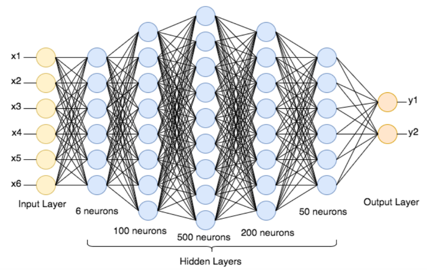

# Neural Network

---

#### **Definition**

A neural network is a computational model inspired by the structure and functionality of the human brain. It consists of layers of interconnected nodes (neurons), which process data through weighted connections to recognize patterns and make predictions. Neural networks are a core component of machine learning, particularly in deep learning, where multiple layers enable complex problem-solving.

---

#### **Usage**

- **Where is it used?**  
  Neural networks are widely used across various domains:

  - **Computer Vision:** Image recognition, facial detection, object detection.
  - **Natural Language Processing (NLP):** Chatbots, translation systems, sentiment analysis.
  - **Healthcare:** Disease diagnosis, drug discovery, personalized medicine.
  - **Finance:** Fraud detection, algorithmic trading, risk assessment.
  - **Gaming:** AI opponents, procedural generation.

- **Why is it essential?**  
  Neural networks excel at recognizing intricate patterns and relationships in data. Their ability to adapt and improve with training data makes them invaluable for automating complex tasks, improving efficiency, and driving innovation.

- **When should it be applied?**  
  Neural networks are ideal when:
  - The problem involves non-linear relationships.
  - Large datasets are available.
  - The task requires high accuracy, such as image classification or voice recognition.
  - Feature engineering is challenging, as neural networks can learn features automatically.

---

#### **Pros and Cons**

- **Advantages:**

  - **High accuracy:** Especially in tasks involving large datasets.
  - **Automatic feature extraction:** Reduces the need for manual engineering.
  - **Versatility:** Can handle various data types, from images to text to time-series data.
  - **Scalability:** Deep neural networks can solve highly complex problems.

- **Limitations:**
  - **Data dependency:** Requires large labeled datasets for effective training.
  - **Computationally expensive:** High hardware requirements for training and inference.
  - **Black-box nature:** Lack of interpretability in decision-making processes.
  - **Overfitting risk:** Without careful regularization, models may memorize rather than generalize.

---

#### **Requirements and Restrictions**

- **Prerequisites:**

  - Access to substantial computational power (e.g., GPUs or TPUs).
  - A dataset of sufficient size and quality.
  - Knowledge of frameworks like TensorFlow, PyTorch, or Keras.
  - Proper preprocessing of data for numerical compatibility.

- **Constraints:**
  - Training times can be significant for deep networks.
  - Limited interpretability for decision-critical applications.
  - May require substantial tuning of hyperparameters.
  - Performance depends on architecture design and data quality.

---

#### **Components and Properties/Features**

- **Key Components:**

  1. **Input Layer:** Accepts raw data for processing.
  2. **Hidden Layers:** Intermediate layers where neurons apply transformations.
  3. **Output Layer:** Generates predictions or outputs.
  4. **Neurons:** Fundamental processing units applying an activation function.
  5. **Weights:** Parameters adjusted during training to optimize performance.
  6. **Biases:** Additional parameters improving flexibility in learning.

- **Key Properties/Features:**
  - **Activation Functions:** Introduce non-linearity (e.g., ReLU, Sigmoid).
  - **Learning Rate:** Determines the step size in weight updates.
  - **Loss Function:** Measures prediction errors (e.g., cross-entropy, MSE).
  - **Optimization Algorithms:** Adjust weights to minimize loss (e.g., SGD, Adam).
  - **Dropout:** Regularization technique to prevent overfitting.

**Roles and Relationships:**  
Input data flows through the network, where weights and biases transform it layer by layer. Activation functions enable non-linear learning, while the optimization process ensures weights adjust to minimize loss.

---

#### **Real-Time Example and Use Case**

- **Example:** Image Recognition with Convolutional Neural Networks (CNNs)  
  A CNN processes a set of medical images to detect tumors.

  1. **Input:** X-ray images.
  2. **Hidden Layers:** Convolutional layers extract features (e.g., edges, shapes).
  3. **Output:** A classification layer predicts if the image contains a tumor.

- **Real-World Scenario:**  
  In healthcare, CNNs are used in radiology to assist doctors by identifying abnormalities in X-rays or MRIs. By training on thousands of labeled medical images, the network achieves high accuracy, reducing diagnostic errors and saving time.

---

#### **Interview Questions**

1. **Definitions:**

   - What is a neural network, and how does it differ from traditional algorithms?
   - Explain the role of activation functions in neural networks.

2. **Scenario-Based Problems:**

   - If a neural network is overfitting, what steps would you take to address the issue?
   - How would you design a network for a multi-class classification problem?

3. **Conceptual Challenges:**

   - Why are vanishing gradients a problem in deep networks, and how can they be mitigated?
   - Discuss the trade-offs between model complexity and interpretability.

4. **Practical Implementation:**
   - Walk through the process of training a neural network on an imbalanced dataset.
   - How would you optimize a neural network's hyperparameters?

This structured explanation covers neural networks comprehensively, making it relevant for both theoretical understanding and practical implementation.

Neural networks come in various architectures designed for specific tasks such as image processing, natural language processing, and time-series forecasting. Below are the major types of neural network architectures:

## 

# **Types of Neural Network architectures**


https://medium.com/towards-data-science/the-mostly-complete-chart-of-neural-networks-explained-3fb6f2367464

## **1. Feedforward Neural Network (FNN)**

- **Structure:** Input layer → Hidden layer(s) → Output layer (forward propagation only)
- **Use Cases:** Classification, regression, and simple pattern recognition
- **Example Models:** Multi-Layer Perceptron (MLP)

---

## **2. Convolutional Neural Network (CNN)**

- **Structure:** Uses convolutional layers, pooling layers, and fully connected layers
- **Use Cases:** Image recognition, object detection, video analysis
- **Example Models:** AlexNet, VGGNet, ResNet, EfficientNet

---

## **3. Recurrent Neural Network (RNN)**

- **Structure:** Contains recurrent connections allowing memory over time steps
- **Use Cases:** Sequential data processing (e.g., speech recognition, time-series forecasting)
- **Example Models:** Vanilla RNN, Long Short-Term Memory (LSTM), Gated Recurrent Unit (GRU)

---

## **4. Transformer Networks**

- **Structure:** Uses self-attention mechanisms instead of recurrence
- **Use Cases:** Natural language processing (NLP), translation, text generation
- **Example Models:** BERT, GPT-4, T5, ViT (Vision Transformer)

---

## **5. Generative Adversarial Network (GAN)**

- **Structure:** Two networks: Generator and Discriminator compete against each other
- **Use Cases:** Image synthesis, data augmentation, deepfake creation
- **Example Models:** DCGAN, StyleGAN, CycleGAN

---

## **6. Autoencoder (AE)**

- **Structure:** Encoder compresses input; Decoder reconstructs original input
- **Use Cases:** Anomaly detection, noise reduction, feature learning
- **Example Models:** Variational Autoencoder (VAE), Sparse Autoencoder

---

## **7. Graph Neural Network (GNN)**

- **Structure:** Works on graph-structured data using message passing and node embeddings
- **Use Cases:** Social network analysis, recommendation systems, molecular simulations
- **Example Models:** GCN (Graph Convolutional Network), GAT (Graph Attention Network)

---

## **8. Capsule Network (CapsNet)**

- **Structure:** Uses dynamic routing instead of pooling layers in CNNs
- **Use Cases:** Image recognition with viewpoint invariance
- **Example Models:** Sabour’s Capsule Network

---

## **9. Self-Organizing Map (SOM)**

- **Structure:** Unsupervised neural network that reduces dimensions and clusters data
- **Use Cases:** Feature mapping, visualization, anomaly detection

---

## **10. Spiking Neural Network (SNN)**

- **Structure:** Mimics biological neuron firing with spike-timing dependent plasticity (STDP)
- **Use Cases:** Neuromorphic computing, energy-efficient AI hardware

---

## basic **Feedforward Neural Network** using **Python and TensorFlow/Keras**.

This program trains a neural network to classify handwritten digits from the **MNIST dataset**.

---

### **Basic Neural Network Program in Python (Using TensorFlow/Keras)**

```python
# Import necessary libraries
import tensorflow as tf
from tensorflow import keras
import numpy as np
import matplotlib.pyplot as plt

# Load the MNIST dataset (handwritten digits 0-9)
# It consists of 60,000 training images and 10,000 test images (28x28 grayscale)
(X_train, y_train), (X_test, y_test) = keras.datasets.mnist.load_data()

# Normalize the pixel values (0-255) to the range [0,1] to improve training performance
X_train, X_test = X_train / 255.0, X_test / 255.0

# Display a sample image
plt.imshow(X_train[0], cmap='gray')
plt.title(f"Label: {y_train[0]}")
plt.show()

# Define the Neural Network Model
model = keras.Sequential([
    keras.layers.Flatten(input_shape=(28, 28)),  # Flatten 28x28 images into a 1D array (28*28 = 784)
    keras.layers.Dense(128, activation='relu'),  # Hidden layer with 128 neurons and ReLU activation
    keras.layers.Dense(10, activation='softmax')  # Output layer (10 classes for digits 0-9) with Softmax activation
])

# Compile the Model
model.compile(optimizer='adam',              # Adam optimizer for efficient learning
              loss='sparse_categorical_crossentropy',  # Loss function for multi-class classification
              metrics=['accuracy'])           # Monitor accuracy during training

# Train the Model
model.fit(X_train, y_train, epochs=5)  # Train for 5 epochs (full passes over the dataset)

# Evaluate the Model on Test Data
test_loss, test_acc = model.evaluate(X_test, y_test)

print(f"Test Accuracy: {test_acc:.4f}")  # Print accuracy of the model on test data

# Make Predictions
predictions = model.predict(X_test)

# Show a sample prediction
plt.imshow(X_test[0], cmap='gray')
plt.title(f"Predicted Label: {np.argmax(predictions[0])}")
plt.show()
```

---

### **Step-by-Step Explanation**

#### **1. Import Required Libraries**

- `tensorflow` and `keras`: Frameworks for building and training neural networks.
- `numpy`: Used for numerical computations.
- `matplotlib.pyplot`: Used for visualizing images and predictions.

#### **2. Load and Preprocess the Dataset**

- The **MNIST dataset** contains handwritten digits (0-9) in 28x28 grayscale images.
- **Pixel values (0-255) are normalized** to [0,1] for better training efficiency.

#### **3. Build the Neural Network Model**

- **Flatten Layer:** Converts 28x28 images into a **1D array (784 pixels)**.
- **Hidden Layer:** A dense layer with **128 neurons** using **ReLU activation** (better for deep networks).
- **Output Layer:** **10 neurons (digits 0-9)** with **Softmax activation** to classify probabilities.

#### **4. Compile the Model**

- **Adam Optimizer:** Efficient gradient-based optimization algorithm.
- **Sparse Categorical Crossentropy:** A loss function used for **multi-class classification**.
- **Accuracy Metric:** Measures how well the model is performing.

#### **5. Train the Model**

- The model is trained with `epochs=5`, meaning it sees the entire dataset **5 times**.

#### **6. Evaluate the Model**

- The model is tested on unseen **test data** to measure its accuracy.

#### **7. Make Predictions**

- The trained model predicts a digit from the test set and displays it.

---

### **Output**

- The program will display:
  - A sample handwritten digit from the dataset.
  - Training progress with accuracy updates.
  - Final test accuracy.
  - A predicted digit from the test dataset.

---
